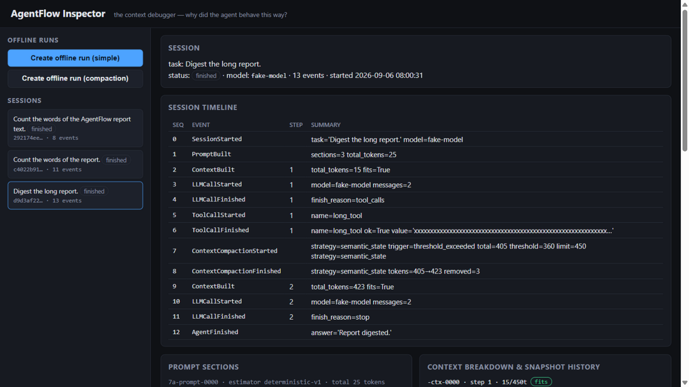
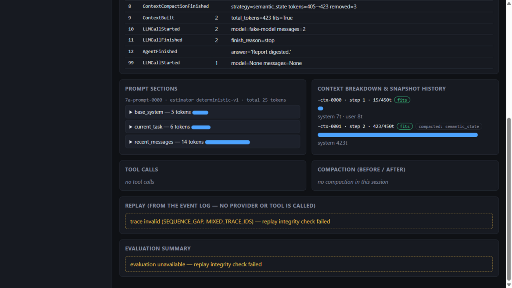

# AgentFlow

**The Context Debugger and Observatory for AI Agents.**

[](https://github.com/ligo-lili/agentflow/actions/workflows/ci.yml)
[](pyproject.toml)
[](LICENSE)

AgentFlow is a job-portfolio MVP for inspecting and evaluating an Agent's runtime behavior: prompt assembly, context composition, tool calls, context growth, compaction and execution trajectory.

## MVP flow

```text
offline task → Agent Runtime → Prompt/Context snapshots → Tool calls
→ Context growth → Compaction → persisted trace → Inspector → Replay
→ trajectory evaluation → strategy comparison
```

All of the above is implemented and offline-deterministic. The runtime uses a scripted `FakeModelProvider` by default, so every demo, test and benchmark runs without network access or an API key.

Recorded runs are guarded by explicit contracts: provider/tool deadlines that can never report timed-out work as success, versioned SQLite schema with an atomic session projection, formal replay integrity (corrupt or truncated traces are rejected, live ones still replay), typed API responses with a stable error envelope, and auditable token counting with estimator-mismatch rejection (docs/architecture/{runtime,persistence,event-model,api,context-engine,evaluation}.md). The A/B evaluation runs a versioned three-scenario suite with semantic survival checks and weight-sensitivity reporting.

## What it looks like

The local Inspector — per-step timeline, prompt sections with token
breakdown, context budget history, compaction before/after, replay from the
event log alone:



A corrupted trace is flagged, never silently replayed:



## What is inside

| Task | Deliverable | Where |
|---|---|---|
| T0 | Typed contracts: events, provider, tools, snapshots, stores | `packages/core`, `packages/observability` |
| T1 | Single-agent runtime: `AgentSession` → bounded `AgentLoop` → `ToolRuntime` | `packages/runtime` |
| T2 | SQLite persistence (events, snapshots, sessions) + reload | `packages/observability/sqlite.py` |
| T3 | Prompt/Context snapshots, token budget (`PromptBuilder`, `ContextManager`) | `packages/context` |
| T4 | Two deterministic compaction strategies (`keep_recent_summary`, `semantic_state`) | `packages/context/compaction.py` |
| T5 | Timeline and replay from the event log alone (no re-execution) | `packages/observability/{timeline,replay}.py` |
| T6 | FastAPI query API + local Web Inspector | `apps/api`, `apps/web/templates` |
| T7 | Rule-based trajectory evaluation and A/B strategy comparison | `packages/evals`, `packages/experiments` |

Design decisions are recorded in `docs/adr/`; per-task evidence reports (with actual command output) live in `docs/evidence/`.

## Quick start

```bash
python -m pip install -e ".[dev]"
make test        # 198 offline tests
make lint        # ruff + mypy (strict on packages and apps)
make coverage    # 95% measured, 80% floor enforced
make demo        # simple agent with a tool call, prints the event trace
make web         # Inspector UI at http://127.0.0.1:8000
```

### Demos

```bash
python examples/simple_agent.py          # runtime: event trace, tool call, final answer
python examples/context_growth_demo.py   # per-step context growth under a token budget
python examples/persistence_reload.py    # two real processes: write to SQLite, reload, compare
python examples/replay_demo.py           # replay a session from the event log alone
python examples/compaction_compare.py    # A/B: both compaction strategies, metrics, score, winner
```

### Inspector

`make web` (or `uvicorn apps.api.main:app`) serves the local Inspector. The page creates an offline run and shows Session Timeline, Prompt Sections, Context Breakdown, snapshot history, Tool Calls, Compaction before/after, Replay (from the event log — never calls a provider or tool) and the Evaluation Summary. The API also exposes the raw surfaces: `GET /api/sessions`, `/events`, `/prompt-snapshots`, `/context-snapshots`, `/replay`, `/evaluation`.

## Scope

The MVP is an offline-first Python runtime with SQLite persistence, a FastAPI query API and a lightweight web Inspector. It does not include a coding-agent replacement, voice/browser/desktop automation, multi-tenant SaaS, vector-first RAG, model training or complex multi-agent orchestration.

## Status: MVP complete — not production-ready

The four-week MVP scope is **complete and verified** (see
[docs/evidence/final-report.md](docs/evidence/final-report.md)); that is a
different claim from production readiness. Deliberate non-goals that would
gate production use:

- **Token counts are an engineering proxy** (documented deterministic
  formula, or tiktoken when installed) — never provider billing tokens.
- **Single process**: SQLite WAL serves the local API workload; no
  multi-process writers, no network filesystems.
- **No auth, no multi-tenancy**: the Inspector and API are localhost tools.
- **Rule-based task completion**: evaluation checks runtime completion, not
  semantic answer correctness; no LLM judge by design.
- **`POST /api/runs` is synchronous and offline-only** (FakeModelProvider);
  a real-provider smoke path exists behind the optional `openai-compat`
  extra (`python scripts/smoke_openai.py`, mocked contract tests only).

## Documentation map

- [Product vision](docs/product/vision.md), [target user](docs/product/target-user.md), [scope](docs/product/scope.md), [interview script](docs/product/interview-script.md)
- [Architecture overview](docs/architecture/overview.md), [runtime](docs/architecture/runtime.md), [persistence](docs/architecture/persistence.md), [context engine](docs/architecture/context-engine.md), [event model](docs/architecture/event-model.md), [API](docs/architecture/api.md), [evaluation](docs/architecture/evaluation.md)
- [Roadmap and task ownership](docs/roadmap/README.md)
- [Architecture decisions](docs/adr/)
- [Evidence index](docs/evidence/README.md) — per-task reports and the [final portfolio report](docs/evidence/final-report.md)

## Success criteria

The project succeeds when a developer can explain why an Agent behaved a certain way, inspect prompt/context lifecycle, replay recorded events without re-running tools or models, and prove that two context strategies are measurably different. All four are demonstrated in `docs/evidence/final-report.md`.

## License

[MIT](LICENSE)
